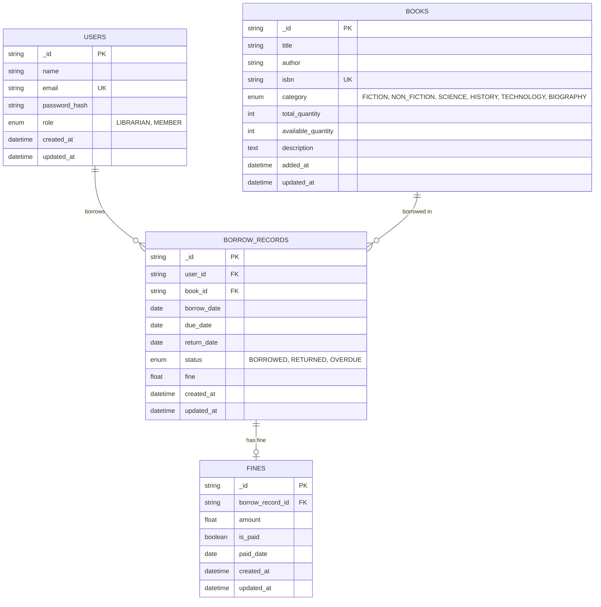

# Entity Relationship (ER) Diagram

This diagram represents the database schema for the Online Library Management System, including all tables, attributes, and relationships.

```mermaid
erDiagram
    USERS {
        string _id PK
        string name
        string email UK
        string password_hash
        enum role "LIBRARIAN, MEMBER"
        datetime created_at
        datetime updated_at
    }

    BOOKS {
        string _id PK
        string title
        string author
        string isbn UK
        enum category "FICTION, NON_FICTION, SCIENCE, HISTORY, TECHNOLOGY, BIOGRAPHY"
        int total_quantity
        int available_quantity
        text description
        datetime added_at
        datetime updated_at
    }

    BORROW_RECORDS {
        string _id PK
        string user_id FK
        string book_id FK
        date borrow_date
        date due_date
        date return_date
        enum status "BORROWED, RETURNED, OVERDUE"
        float fine
        datetime created_at
        datetime updated_at
    }

    FINES {
        string _id PK
        string borrow_record_id FK
        float amount
        boolean is_paid
        date paid_date
        datetime created_at
        datetime updated_at
    }

    USERS ||--o{ BORROW_RECORDS : "borrows"
    BOOKS ||--o{ BORROW_RECORDS : "borrowed in"
    BORROW_RECORDS ||--o| FINES : "has fine"
```
