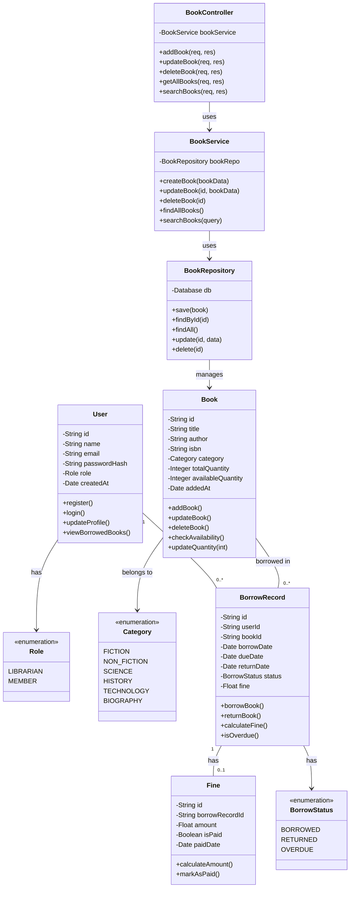

# Class Diagram

The following diagram represents the core classes and their relationships in the Online Library Management System.

```mermaid
classDiagram
    class User {
        -String id
        -String name
        -String email
        -String passwordHash
        -Role role
        -Date createdAt
        +register()
        +login()
        +updateProfile()
        +viewBorrowedBooks()
    }

    class Role {
        <<enumeration>>
        LIBRARIAN
        MEMBER
    }

    class Book {
        -String id
        -String title
        -String author
        -String isbn
        -Category category
        -Integer totalQuantity
        -Integer availableQuantity
        -Date addedAt
        +addBook()
        +updateBook()
        +deleteBook()
        +checkAvailability()
        +updateQuantity(int)
    }

    class Category {
        <<enumeration>>
        FICTION
        NON_FICTION
        SCIENCE
        HISTORY
        TECHNOLOGY
        BIOGRAPHY
    }

    class BorrowRecord {
        -String id
        -String userId
        -String bookId
        -Date borrowDate
        -Date dueDate
        -Date returnDate
        -BorrowStatus status
        -Float fine
        +borrowBook()
        +returnBook()
        +calculateFine()
        +isOverdue()
    }

    class BorrowStatus {
        <<enumeration>>
        BORROWED
        RETURNED
        OVERDUE
    }

    class Fine {
        -String id
        -String borrowRecordId
        -Float amount
        -Boolean isPaid
        -Date paidDate
        +calculateAmount()
        +markAsPaid()
    }

    class BookController {
        -BookService bookService
        +addBook(req, res)
        +updateBook(req, res)
        +deleteBook(req, res)
        +getAllBooks(req, res)
        +searchBooks(req, res)
    }

    class BookService {
        -BookRepository bookRepo
        +createBook(bookData)
        +updateBook(id, bookData)
        +deleteBook(id)
        +findAllBooks()
        +searchBooks(query)
    }

    class BookRepository {
        -Database db
        +save(book)
        +findById(id)
        +findAll()
        +update(id, data)
        +delete(id)
    }

    User "1" -- "0..*" BorrowRecord : borrows
    Book "1" -- "0..*" BorrowRecord : borrowed in
    BorrowRecord "1" -- "0..1" Fine : has
    
    BookController --> BookService : uses
    BookService --> BookRepository : uses
    BookRepository --> Book : manages
    
    User --> Role : has
    Book --> Category : belongs to
    BorrowRecord --> BorrowStatus : has
```
