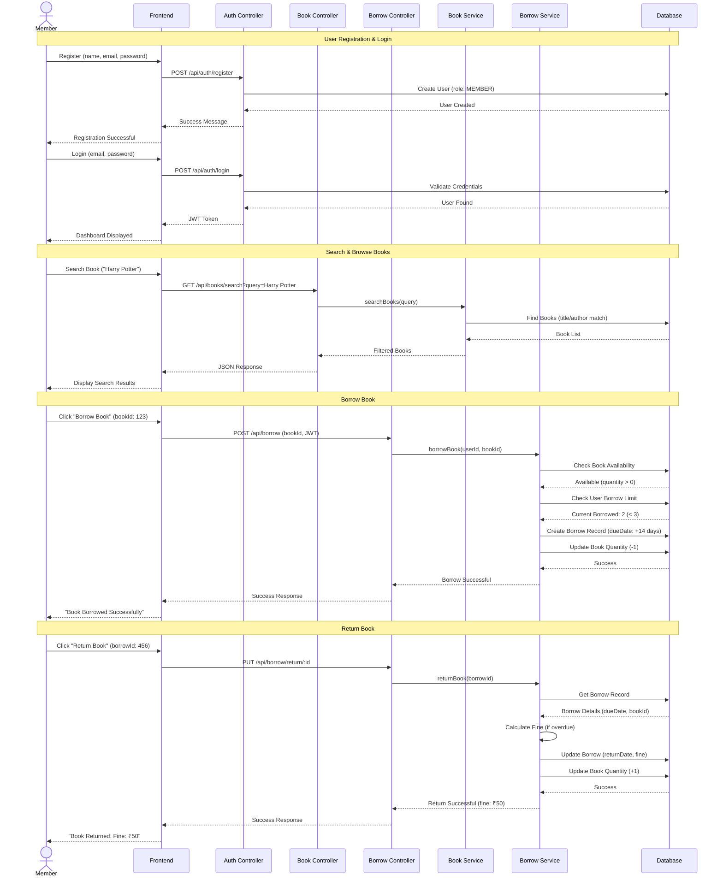

# Sequence Diagram

This sequence diagram shows the complete flow of a Member registering, searching for a book, borrowing it, and returning it.

```mermaid
sequenceDiagram
    actor M as Member
    participant FE as Frontend
    participant Auth as Auth Controller
    participant BC as Book Controller
    participant BorrowC as Borrow Controller
    participant BS as Book Service
    participant BorrowS as Borrow Service
    participant DB as Database

    Note over M, DB: User Registration & Login

    M->>FE: Register (name, email, password)
    FE->>Auth: POST /api/auth/register
    Auth->>DB: Create User (role: MEMBER)
    DB-->>Auth: User Created
    Auth-->>FE: Success Message
    FE-->>M: Registration Successful

    M->>FE: Login (email, password)
    FE->>Auth: POST /api/auth/login
    Auth->>DB: Validate Credentials
    DB-->>Auth: User Found
    Auth-->>FE: JWT Token
    FE-->>M: Dashboard Displayed

    Note over M, DB: Search & Browse Books

    M->>FE: Search Book ("Harry Potter")
    FE->>BC: GET /api/books/search?query=Harry Potter
    BC->>BS: searchBooks(query)
    BS->>DB: Find Books (title/author match)
    DB-->>BS: Book List
    BS-->>BC: Filtered Books
    BC-->>FE: JSON Response
    FE-->>M: Display Search Results

    Note over M, DB: Borrow Book

    M->>FE: Click "Borrow Book" (bookId: 123)
    FE->>BorrowC: POST /api/borrow (bookId, JWT)
    BorrowC->>BorrowS: borrowBook(userId, bookId)
    BorrowS->>DB: Check Book Availability
    DB-->>BorrowS: Available (quantity > 0)
    BorrowS->>DB: Check User Borrow Limit
    DB-->>BorrowS: Current Borrowed: 2 (< 3)
    BorrowS->>DB: Create Borrow Record (dueDate: +14 days)
    BorrowS->>DB: Update Book Quantity (-1)
    DB-->>BorrowS: Success
    BorrowS-->>BorrowC: Borrow Successful
    BorrowC-->>FE: Success Response
    FE-->>M: "Book Borrowed Successfully"

    Note over M, DB: Return Book

    M->>FE: Click "Return Book" (borrowId: 456)
    FE->>BorrowC: PUT /api/borrow/return/:id
    BorrowC->>BorrowS: returnBook(borrowId)
    BorrowS->>DB: Get Borrow Record
    DB-->>BorrowS: Borrow Details (dueDate, bookId)
    BorrowS->>BorrowS: Calculate Fine (if overdue)
    BorrowS->>DB: Update Borrow (returnDate, fine)
    BorrowS->>DB: Update Book Quantity (+1)
    DB-->>BorrowS: Success
    BorrowS-->>BorrowC: Return Successful (fine: ₹50)
    BorrowC-->>FE: Success Response
    FE-->>M: "Book Returned. Fine: ₹50"
```
