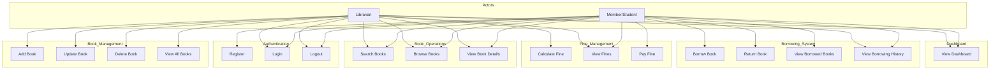

# Use Case Diagram

The following diagram illustrates the interactions between different users (Actors) and the Online Library Management System.

```mermaid
graph TB
    subgraph Actors
        L[Librarian]
        M[Member/Student]
    end

    subgraph Authentication
        UC1[Register]
        UC2[Login]
        UC3[Logout]
    end

    subgraph Book_Management
        UC4[Add Book]
        UC5[Update Book]
        UC6[Delete Book]
        UC7[View All Books]
    end

    subgraph Book_Operations
        UC8[Search Books]
        UC9[Browse Books]
        UC10[View Book Details]
    end

    subgraph Borrowing_System
        UC11[Borrow Book]
        UC12[Return Book]
        UC13[View Borrowed Books]
        UC14[View Borrowing History]
    end

    subgraph Fine_Management
        UC15[Calculate Fine]
        UC16[View Fines]
        UC17[Pay Fine]
    end

    subgraph Dashboard
        UC18[View Dashboard]
    end

    M --> UC1
    M --> UC2
    M --> UC3
    M --> UC8
    M --> UC9
    M --> UC10
    M --> UC11
    M --> UC12
    M --> UC13
    M --> UC14
    M --> UC16
    M --> UC17
    M --> UC18

    L --> UC2
    L --> UC3
    L --> UC4
    L --> UC5
    L --> UC6
    L --> UC7
    L --> UC8
    L --> UC9
    L --> UC10
    L --> UC14
    L --> UC15
    L --> UC16
    L --> UC18
```
